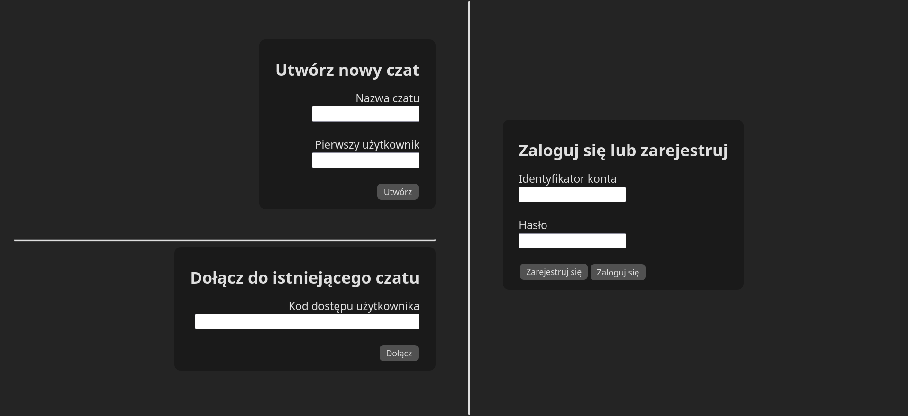
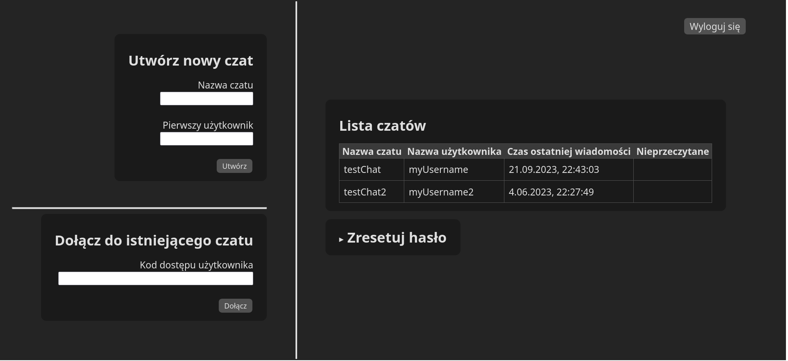
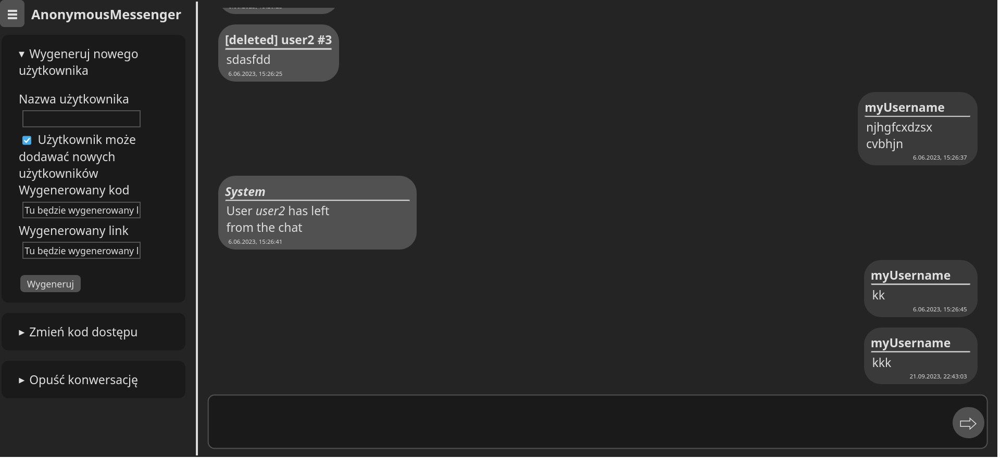

# Simple text messenger

Demo deployed on [anonymous-messenger.onrender.com](https://anonymous-messenger.onrender.com/).

Available in: english, polish, germany and french.
(Translated with ChatGPT)

Build:
```
# With transcient database:
docker build --build-arg TRANSIENT_DATABASE=TRUE -t anonymous-messenger .

# Without transcient database (default):
docker build --build-arg TRANSIENT_DATABASE=FALSE -t anonymous-messenger .
# or
docker build -t anonymous-messenger .
```

Required environment variables (may be skiped when use transcient database):
```
DATABASE_HOST
DATABASE_NAME
DATABASE_PASS
DATABASE_USER
DATABASE_PORT
AES_KEY
```



<br>

<br>

